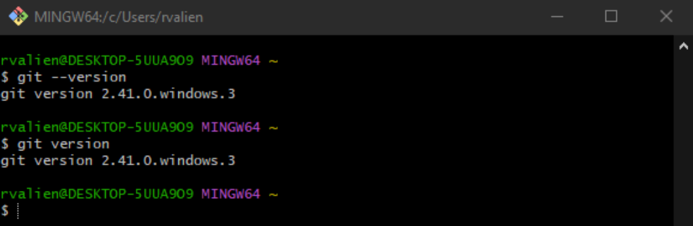
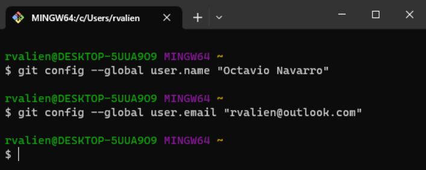
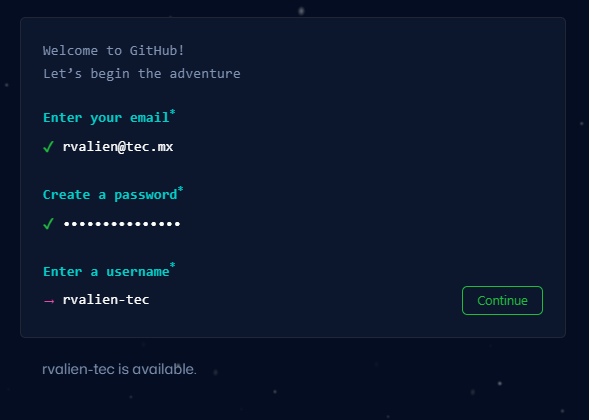
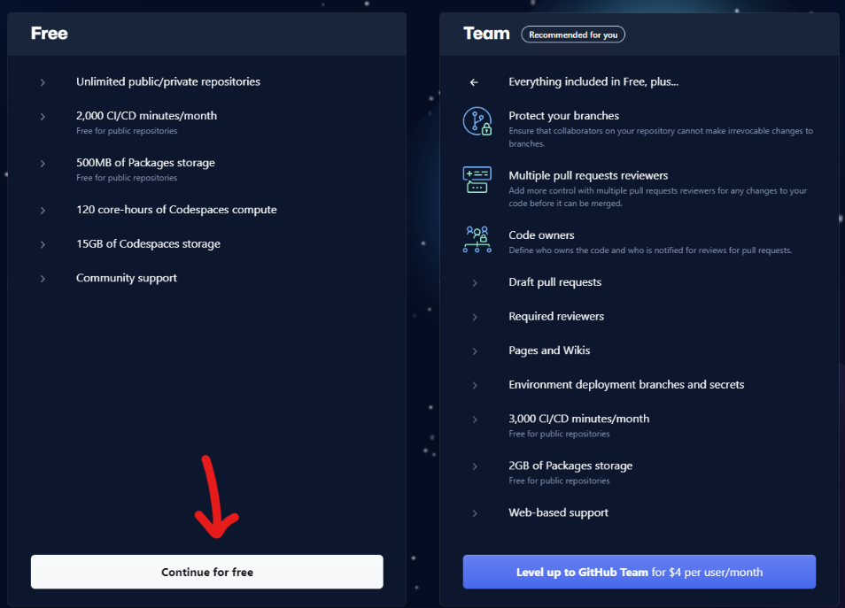
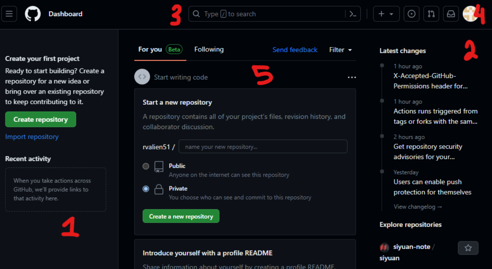
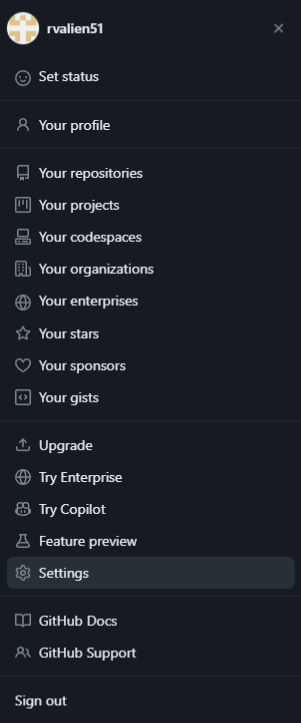
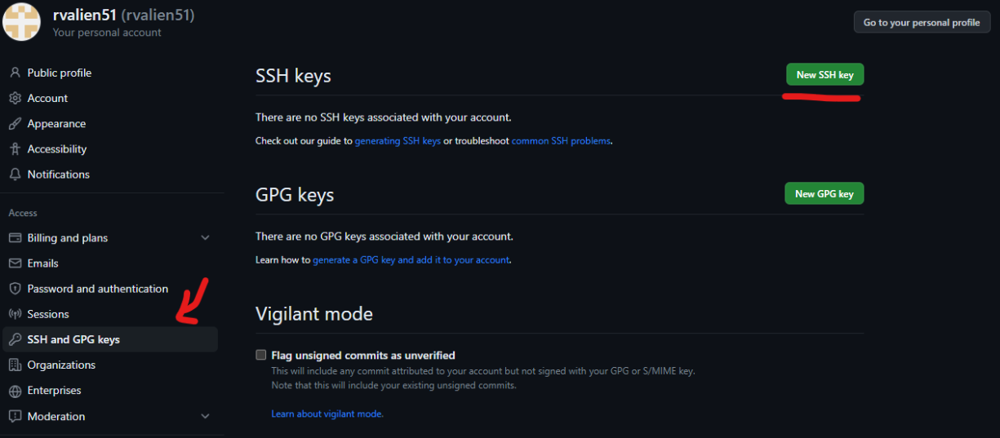
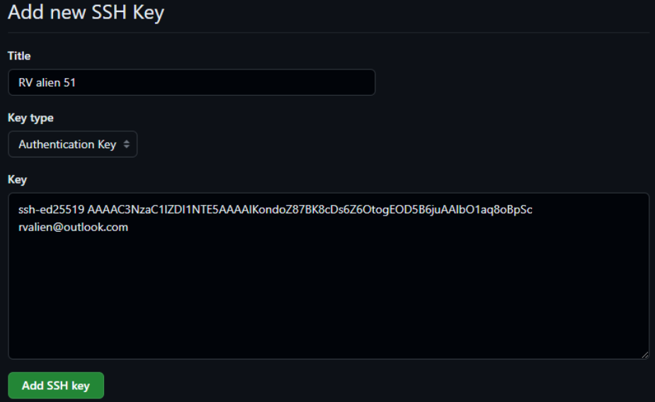

# Installing git, and exploring github

Before you start using [Git](https://docs.github.com/en/get-started/learning-about-github/github-glossary#git), you have to make it available on your computer. Even if it’s already installed, it’s probably a good idea to update to the latest version. You can either install it as a package or via another installer, or download the source code and compile it yourself.

After you install git, you will create an account in [Github](https://github.com/), and explore the application. GitHub is a collaboration platform that uses Git for versioning. GitHub is a popular place to share and contribute to open-source software.

## Overview

In this activity, you will:

- [Install git](#installing-git)
- [Configure git on your machine](#configure-git-on-your-machine)
- [Create an account on github](#create-an-account-on-github)
- [Explore github](#explore-github)
- [Configure remote access to github](#configure-remote-access-to-github)

## Steps

### Installing git

#### Installing on Windows

There are several ways to install Git on Windows.

##### Git website

Enter [the following link](https://git-scm.com/download/win) and select the 64-bit version. After it downloads, run the executable, and follow the on screen instructions.

##### Using Choco

To get an automated installation you can use the [Git Chocolatey package](https://community.chocolatey.org/packages/git). [Chocolatey](https://chocolatey.org/) is a package management solution for Windows.

```powershell
choco install git
```

#### Installing on macOS

There are several ways to install Git on macOS.

##### Homebrew

Install [homebrew](https://brew.sh/) if you don't already have it. Then run the following command in a terminal:

```bash
$ brew install git
```

##### Xcode

The easiest is probably to install the Xcode Command Line Tools. On Mavericks (10.9) or above you can do this simply by trying to run git from the Terminal the very first time.

```bash
$ git --version
```

If you don’t have it installed already, it will prompt you to install it.

### Configure git on your machine

After the installation, you will need to configure the local environment so that you can start using git. Git comes with a [configuration](https://git-scm.com/docs/git-config) both at the global and the repo (project) level. Most of the time, you'll just use the **global config**.

1. In windows, search for a program called **Git bash**, and run it. In macOS, open a **Terminal**. These programs provide an emulation layer for a Git command line experience.

2. To verify that the installation was correct, type the command: `git --version`. If it gives us the Git version, then everything was installed correctly.



3. Run the following commands so that Git knows the information of the user that is interacting with it. Run each command separately, changing the text inside the brackets to both your user name and contact email, respectively. The last command sets a default text editor for use in the terminal; more on that later.

```bash
$ git config --global user.name "<your name>"
$ git config --global user.email "<your email>"
$ git config --global core.editor "nano"
```

For example:



4. We're using master as the default branch because it is Git's default. To change it to main, which is GitHub's default, run the following command:

```bash
$ git config --global init.defaultBranch main
```

5. After that, you can close Git bash, or your terminal.

### Create an account on github

While Git is a version control system, which allows developers to track changes to their code, Github is a web platform that allows repositories to be stored remotely. In order to have our repositories stored on Github, we need to create an account.

1. Enter [github.com](https://github.com)
2. On the top-right side, press the button **Sign up**.


3. Enter de information that is prompted on screen:



4. They will send you a verification code to your email. Copy it and paste it in the corresponding section.

5. After you verify your account, you will be asked a few questions about your interests and purpose around using github.


6. Then, select the free github plan:



7. Once the process is finished, your dashboard will open, and you can start using Github and create repositories. Before creating one, we have to know how to get around Github.


### Explore github

Here is an overview of the dashboard screen:



1. On the left side are all the repositories that you have created or are participating in. It also allows you to create a new repository.

2. On the right side appears the option to explore other people's repositories.

3. At the top left is the search bar, where you can search for other people's repositories, users, previews, and code.

4. At the top right is your account settings, where you can modify your profile data, consult your repositories, review your notifications and configure aspects of your account (security, billing, etc...).

5. In the central part there is the 'Explore Github' button, which will show you repositories and projects related to the interests you established when creating your account.

### Configure remote access to github

For security reasons, Github disabled the option to interact with a repository in the terminal using username and password. One option is to create a personal access token, however, we are going to use the Secure Shell (SSH) protocol to connect to GitHub without needing to provide the username and personal access token in each interaction.

The most important feature of SSH is that it is always done securely. Thanks to SSH, the information that travels through the Network is not readable by third parties and, to this end, all information transit is carried out by encrypting the data.

For more information about SSH, see [Secure Shell on Wikipedia](https://en.wikipedia.org/wiki/Secure_Shell).

In order to connect to a remote system, certain keys must be authorized to access a system. An SSH key is a credential that uses the SSH protocol. Their function is similar to that of usernames and passwords, but keys are mainly used for automated processes.

Typically two keys are generated for this: a public key and a private key. The private key
stays on the user's computer, while the public key is sent to the server you want to access. In this way, the server will give access to anyone who has the private key that corresponds to the public key it has stored.

When you set up the SSH connection, you will need to generate a new combination of private and public keys. Then, add the private one to the SSH agent, while you add the public SSH key to your account on GitHub before you use the key to authenticate or sign commits.

Follow the next steps to generate the keys:

1. Open Git bash, or the terminal in macOS.
2. Paste the text below, replacing the email used in the example with your GitHub email address.

```bash
ssh-keygen -t ed25519 -C "your_email@example.com"
```

This creates a new SSH key, using the provided email as a label.

3. When you're prompted to "Enter a file in which to save the key", you can press Enter to accept the default file location. Please note that if you created SSH keys previously, ssh-keygen may ask you to rewrite another key, in which case we recommend creating a custom-named SSH key. To do so, type the default file location and replace id_ALGORITHM with your custom key name.

```bash
Enter file in which to save the key (/c/Users/YOU/.ssh/id_ALGORITHM):[Press enter]
```
At the prompt, it is ideal, albeit optional, to type a secure passphrase.

```bash
> Enter passphrase (empty for no passphrase): [Type a passphrase]
> Enter same passphrase again: [Type passphrase again]
```

4. You have to add the SSH key to an agent who is in charge of managing your keys.
5. Verify that the ssh-agent agent is running. In git bash enter the following command:

```bash
$ eval "$(ssh-agent -s)"
```

5. Add your SSH private key to the ssh-agent. If you created your key with a different name or if you are adding an existing key that has a different name, replace *_id_ed25519* in the command with the name of your private key file.

```bash
$ ssh-add ~/.ssh/id_ed25519
```

6. Once the key has been created locally, it must be added to Github to be able to access it.

7. View the public SSH key using the following command:

```bash
$ cat ~/.ssh/id_ed25519.pub
```

8. Copy the text that appears in the terminal, starting with ssh-ed25519 and ending with your email address

9. In the top right corner of any Github page, click the profile photo, then click Settings.



10. In the following screen, on the left-size menu, click on **SSH and GPG Keys**. Then click on **New SSH Key**.



11. In the next window, give a name to the key in the field **Title**, and paste the public key in the field **Key**. Finally, click the **Add SSH Key** button.



## Finish

After you finish this activity, you should have:

- Git installed on your local machine
- A github account
- Completed the setup of a pair of SSH keys, and add them to github

## Resources

- [Connecting with ssh](https://docs.github.com/en/authentication/connecting-to-github-with-ssh/about-ssh)
