# Creating repositories and making commits

People use GitHub to build some of the most advanced technologies in the world. Whether you’re visualizing data or building a new game, there’s a whole community and set of tools on GitHub that can help you do it even better.

A repository is a centralized space where computer files are uploaded, saved, organized, and downloaded. In software engineering they are used to manage projects that involve the use of source code files. On Github you can create several repositories to work with other people on interdisciplinary projects, and share your progress to receive feedback or help others in their respective work.

In this activity you will learn how to create, manage, and make changes to a repository.

**What is a repository?**: A [repository](https://docs.github.com/get-started/quickstart/github-glossary#repository) is a project containing files and folders. A repository tracks versions of files and folders. For more information, see "[About repositories](https://docs.github.com/en/repositories/creating-and-managing-repositories/about-repositories)" from GitHub Docs.

## Overview

In this activity, you will:

1. [Create a new repository](#create-a-new-repository). 
2. [Make changes to a file in github](#make-changes-to-a-file-in-github)
3. [Create a new file, and make changes to it](#create-a-new-file-and-make-changes-to-it)

## Tasks

### Create a new repository

1. In your main dashboard in github, select the **Repositories** tab.

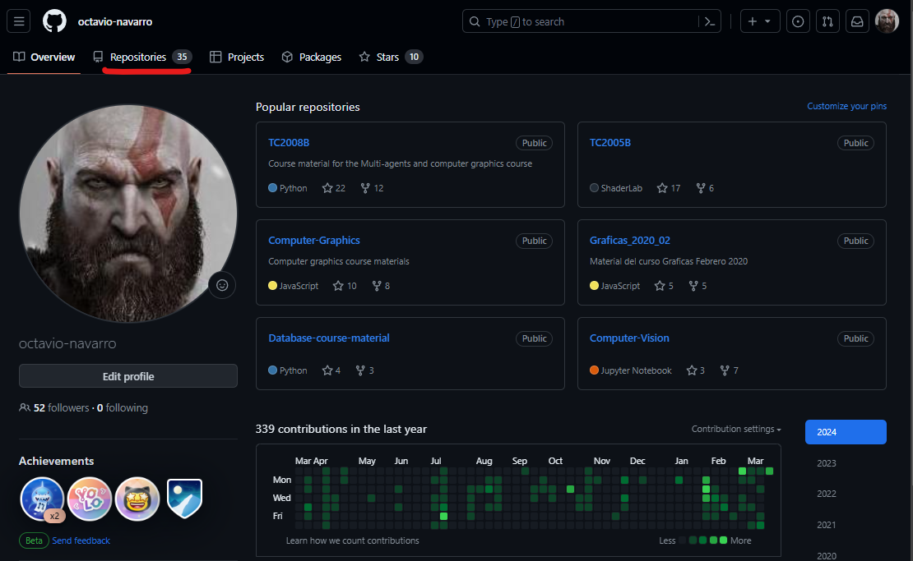

2. Then, click the **New** button on the top right corner.

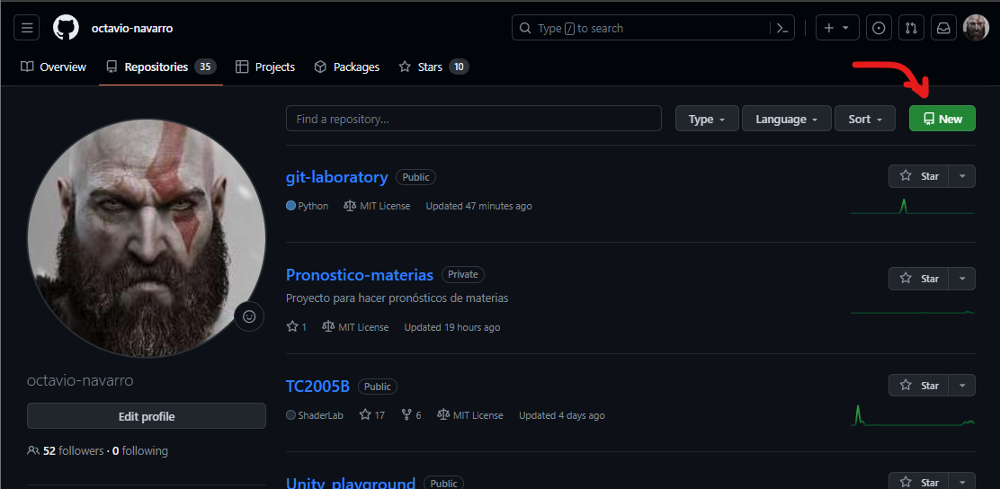

3. Fill the information on the form that appears:

    a. There is no need for a template.

    b. Verify that you are the owner of the repository.

    c. For the name, use: **git-lab**.

    d. In description, type: **Git practice laboratory**.

    e. For now, make sure it is **Public**.

    f. Don't forget to **Add a README file**.

    g. There is no need for a **.gitignore** file for now. We will use those kind of files later.

    h. You can use different licences for your project. For now, select **MIT Licence**.

    i. Finally, click the **Create repository** button.

    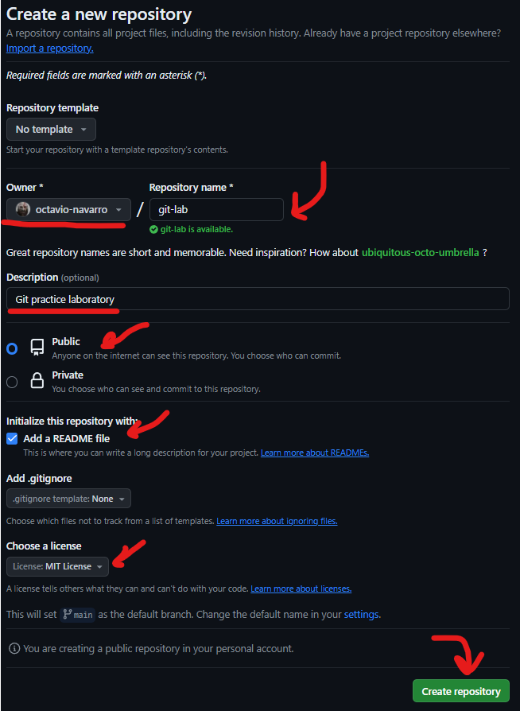

    After clicking the button, the repository will be ready.

    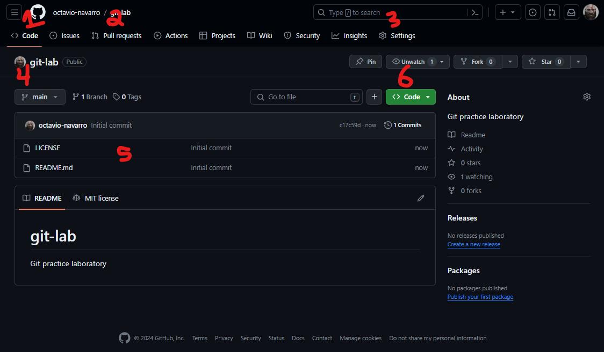

    The main parts of the repository are:

    1. At the top, there are the tabs to review the status of the repository: Code, Issues, Pull Requests, Configuration, etc…
    2. The pull requests tab is important for when you collaborate with other users.
    3. The settings allow you to configure your repository.
    4. Indicates the name of the branch you are currently in. The default branch of any repository is called “main”. (We will see this later).
    5. Below the name of the branch, all the content that is saved in the repository appears (files, documents, source code, etc…)
    6. The code button is used to make local copies of the repository.

### Make changes to a file in github

The following steps will guide you through the process of committing a change on GitHub. A commit records changes in renaming, changing content within, creating a new file, and any other changes made to your project.

To create a change to a repository, you need to create a commit first. We are going to make changes to the README.md file, and add them to the repository. 

**What is a commit?**: A [commit](https://docs.github.com/en/get-started/learning-about-github/github-glossary#commit) is a set of changes to the files and folders in your project. For more information, see "[About commits](https://docs.github.com/en/pull-requests/committing-changes-to-your-project/creating-and-editing-commits/about-commits)".

**What is a README.md?**: A [README](https://docs.github.com/en/get-started/learning-about-github/github-glossary#readme), along with a repository license, citation file, contribution guidelines, and a code of conduct, communicates expectations for your project and helps you manage contributions. The file contains information about the files in a repository that is typically the first file a visitor to your repository will see. For more information, see "[About READMEs](https://docs.github.com/en/repositories/managing-your-repositorys-settings-and-features/customizing-your-repository/about-readmes)".

1. Click on the **README.md** file in your repository.
2. Click on the *pencil* icon to edit the file within github.

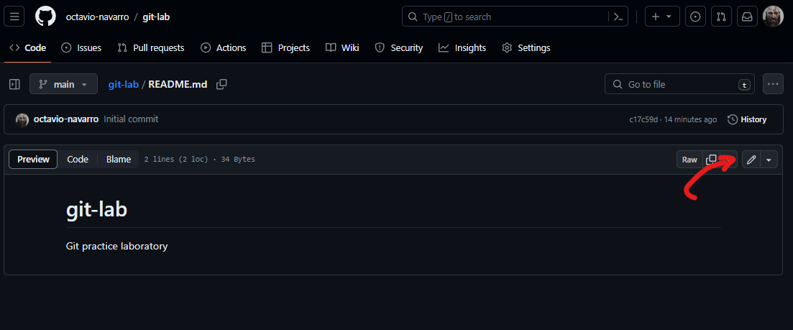

3. On the next screen, you can edit the **README.md** file. Modify by changing the title, and add your name at the end of the file. After you make changes to the file, the **Commit changes...** button at the top right will be enabled.

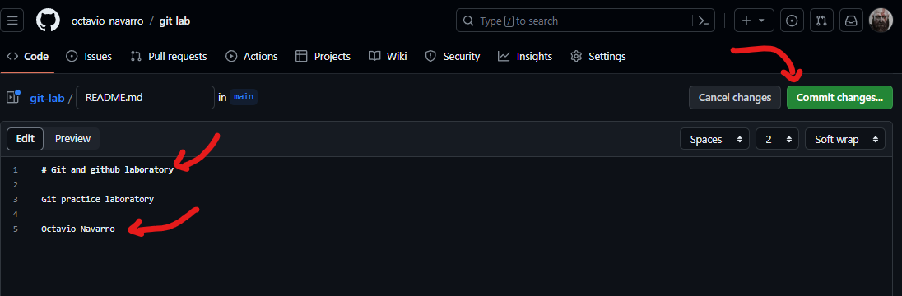

4. When you click the button, you will be prompted for a description of the commit. Try to always include a description of the work you did. After you add the description, click the **Commit changes** button.

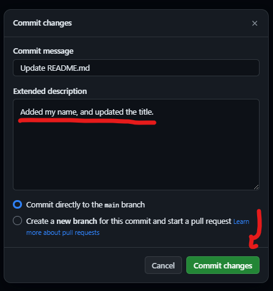

5. Back on the main page of you code, you can see that the changes to the README.md file are already applied.

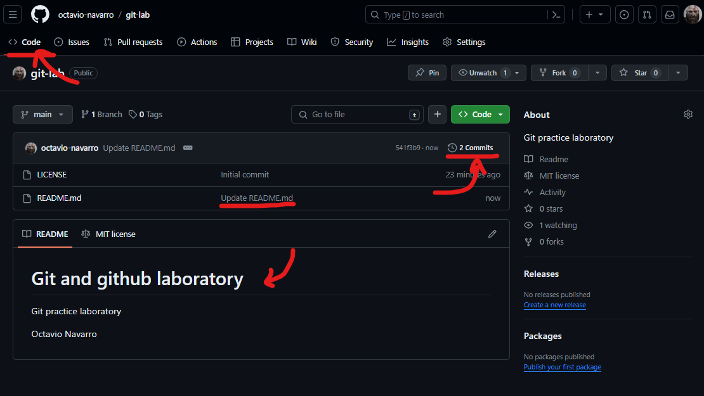

6. If you click on the **Commits**, you can see the history of the commits that have been made to the repository. You should have 2 commits: an initial commit for when the repository was created, and the commit you just made.

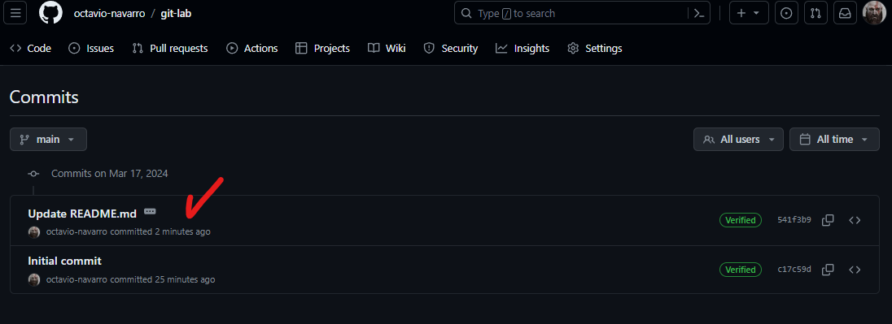

### Create a new file, and make changes to it

You can also create new files directly in github. We are going to create a new file, and commit the changes to the repository.

1. Click on the **Add file** button, and then on the **Create new file**. You can also upload files from your computer from here.

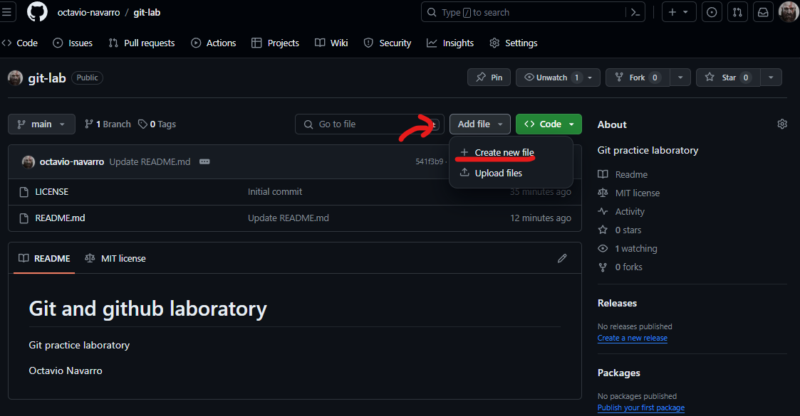

2. In the name, add **hello_world.py**. In the contents of the file, create a simple hello world in python. Finally, click on the **Commit changes...** button, and follow the same steps as the previous section to create your commit.

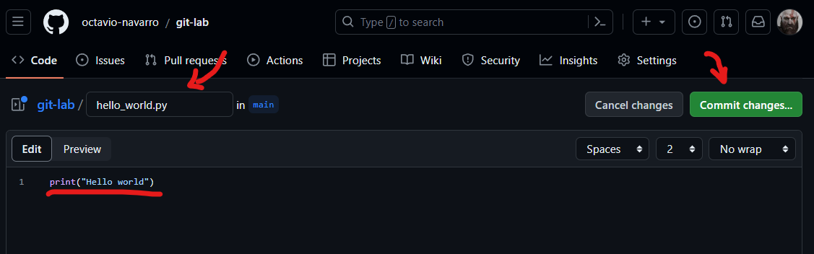

3. After you made the commit, you should have something like the following:

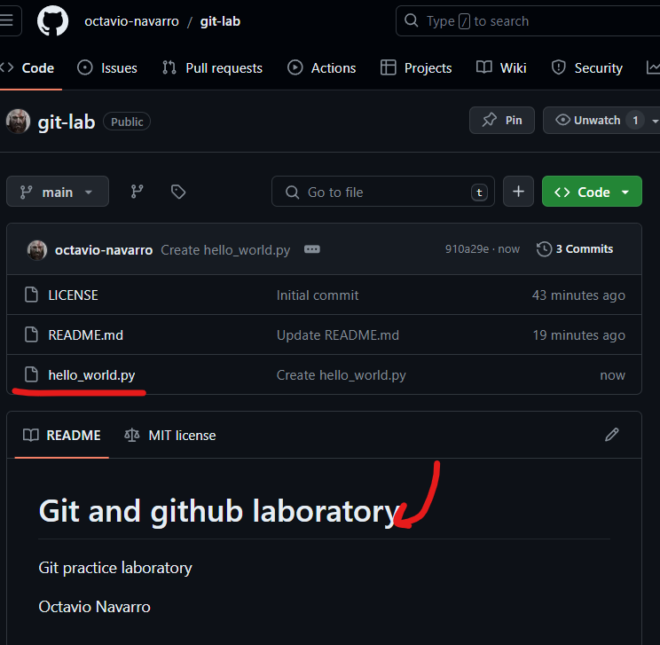

## Finish

After you finish this activity, you should know:

- How to create a repository.
- How to make changes to a file in github.
- How to create new files, and add them to the repository.

## Resources

- [About repositories](https://docs.github.com/en/repositories/creating-and-managing-repositories/about-repositories)
- [About READMEs](https://docs.github.com/en/repositories/managing-your-repositorys-settings-and-features/customizing-your-repository/about-readmes)
- [About commits](https://docs.github.com/en/pull-requests/committing-changes-to-your-project/creating-and-editing-commits/about-commits)
- [Licensing a repository](https://docs.github.com/en/repositories/managing-your-repositorys-settings-and-features/customizing-your-repository/licensing-a-repository)
