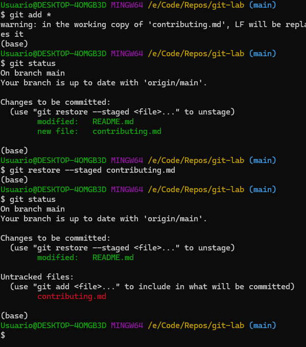

# Working with local and remote repositories

As we have seen, a repository is a space to save, manage and organize the files of a project. However, if your computer is where you do all the work, how can you download a remote repository and work locally?

This is where the concepts of local and remote repository come in. You see, all your repositories on Github are versions of your project that are hosted on the Internet or any other network, therefore, they are remote spaces.

To access its contents, you need to create a space on your computer from which you can send and receive changes made to it. We will call this place local repositories. In this section, you will learn how to create a local repository on your computer and then connect it to the remote repository you just created on Github.

**What is a remote?**: This is the version of a repository or branch that is hosted on a server, most likely GitHub.com. Remote versions can be connected to local clones so that changes can be synced.

**What is a clone?**: A clone is a copy of a repository that lives on your computer instead of on a website's server somewhere, or the act of making that copy. When you make a clone, you can edit the files in your preferred editor and use Git to keep track of your changes without having to be online. The repository you cloned is still connected to the remote version so that you can push your local changes to the remote to keep them synced when you're online.

## Overview

In this activity, you will:

- [Clone a remote repository in your computer.](#cloning-the-remote-repository)
- [Making and pushing local commits](#making-and-pushing-local-commits)
- [Amend a commit](#amend-a-commit)
- [Unstaging a staged file](#unstaging-a-staged-file)
- [Unmodifying a Modified File](#unmodifying-a-modified-file)

## Steps

### Cloning the remote repository

1. Create a folder on your computer (name it with a single word).
2. From Git bash, or the terminal, enter the directory you just created.
3. On Github, go to your repository.
4. On the right side, press the **Code** button. A window appears with options to make the clone. Verify that you selected the SSH option. Copy the address that appears there, either by pressing the **Copy url to clipboard** button, or by copying the adress itself.


5. Back in the terminal, we will use the **git clone** command to make a local copy of the repository. Make sure to replace `{ssh url}` with the address you just copied.

```bash
$ git clone {ssh url}
```


**Note**: If you see the option “Are you sure you want to continue connecting (yes/no/[fingerprint])?” indicate **yes**.

6. Your remote repository will be cloned (downloaded) inside a directory of the same name of the repository, creating your local repository.


7. You can now edit file and make local commits.

### Making and pushing local commits

Now that we have the local repository ready on our computer, we can start making changes on it.

To upload content to a remote repository branch, files must go through several stages in which the changes that have been made to them are updated and tested. For this we will the following Git commands:

- **git add {file or directory}**: If the file is already being tracked by the repository, it is added to the staging area. If not, the repository starts tracking the file, and adds it to the staging area.
- **git commit -m “{Commit description}”**: Register the changes in the local repository's history.
- **git push origin {Branch}**: Push files from your local repository to the remote repository.

With this, we can start uploading content to the repository we just created. The usual workflow with a repository is as follows:


Let's create a file, add it to the local repository, and then upload it to the remote repository.

1. Inside the repository's directory, create a new file called: **Repo.html**.
2. Copy the following code inside the file, and save the changes:
```html
<!DOCTYPE HTML>
<html>
    <head>
        <title>Version control</title>
    </head>
    <body>
        <main>
            <h1>Git and Github lab!</h1>
        </main>
    </body>
</html>
```
3. Open git bash, or the terminal.
4. Access the directory where your local repository is located.
5. Execute the following commands in order:

```bash
# Shows the current state of the repository. The Repo.html file
# should be in an untracked state.
$ git status 

# Git will start tracking the file, and also adds it to the staging area.
$ git add Repo.html 

# It will show that the file is in the stagin area, ready to be commited.
$ git status

# Creates a commit of the files in the staging area. Remember to add a meaningul message.
$ git commit -m "Added Repo.html file."

# It should show that you have commits that are not in the remote repository.
$ git status

# Takes the local commits, and sends them to the remote repository, syncing their histories.
$ git push -u origin main
```


7. Use the **git log** command to see the history of the repository. It will show what commit all the pointers are located. In this case, both the local repository (HEAD), and the remote repository (origin/main), are pointing to the last commit.
 


6. Back in github, you should see the file we just created.


### Unstaging a Staged File

The next two sections demonstrate how to work with your staging area and working directory changes. The nice part is that the command you use to determine the state of those two areas also reminds you how to undo changes to them. For example, let’s say you’ve changed two files and want to commit them as two separate changes, but you accidentally type `git add *` and stage them both. How can you unstage one of the two? The **git status** command reminds you:

```bash
$ git add *
$ git status
On branch main
Your branch is up to date with 'origin/main'.

Changes to be committed:
  (use "git restore --staged <file>..." to unstage)
        modified:   README.md
        new file:   contributing.md
```

You can use the **git restore** command to unstage a file. For example, to unstage the **contributing.md** file:

```bash
$ git restore --staged contributing
```
After the **git restore**, you remove the file from the staging area, but the changes to the file remain.

The complete process looks like:



#### Tasks

1. Create a new file: **config.json**.
2. Add the following text to the file:

```json
{
  "database": {
    "host": "localhost",
    "port": 5432,
    "name": "mydb",
    "user": "myuser"
  },
  "server": {
    "host": "0.0.0.0",
    "port": 3000
  },
  "logging": {
    "level": "info",
    "file": "./logs/app.log"
  }
}
```
3. Make a commit with the file, and push the changes to the remote repository.
4. Now, add an image to the **README.md** file.
5. Modify the **logging** key, so it looks like this:

```json
  "logging": {
    "level": "info",
    "file": "./logs/app.log",
    "host": "192.5.5.1"
  }
```

6. Add both files to the staging area.
7. Use the **git restore** command to remove the **config.json** file from the staging area.
8. Do not commit or modify the **config.json** file any further; we will use it in the next set of tasks.

### Unmodifying a Modified File

What if you realize that you don’t want to keep your changes to the **contributing.md** file? How can you easily unmodify it — revert it back to what it looked like when you last committed (or initially cloned, or however you got it into your working directory)? Luckily, git status tells you how to do that, too. In the last example output, the unstaged area looks like this:

```bash
$ git status
On branch main

Changes not staged for commit:
  (use "git add <file>..." to update what will be committed)
  (use "git restore <file>..." to discard changes in working directory)
        modified:   contributing.md

no changes added to commit (use "git add" and/or "git commit -a")
(base)
```

You can also use the **git restore** command to discard those changes.

```bash
$ git restore contributing.md
```

**IMPORTANT** Note that the git restore does not have a **--staged** parameter. **git restore** is kind of dangerous, because if you use it, any local, uncommited, changes to file are gone. Git replaces the file with the last staged or committed version.

#### Tasks

1. Use the **git restore** command to discard the changes to the **config.json** file.
2. After you discard the changes to the file, make a commit only with the changes to the **README.md** file.
3. Push the commits to the remote repository.

## Finish

After you finish this activity, you should know:

- How to create files in the local repository. 
- How to track them, or add them to the staging area.
- How to create local commits.
- How to sync local changes to the remote repository.
- How to remove files form the staging area, and how to discard changes to a file.

## Resources

- [git commands](https://education.github.com/git-cheat-sheet-education.pdf) 
- [git add documentation](https://git-scm.com/docs/git-add)
- [git commit documentation](https://git-scm.com/docs/git-commit)
- [git status documentation](https://git-scm.com/docs/git-status)
- [git push documentation](https://git-scm.com/docs/git-push)
- [Working with remotes](Linkhttps://git-scm.com/book/en/v2/Git-Basics-Working-with-Remotes#Fetching-and-Pulling-from-Your-Remotes)
