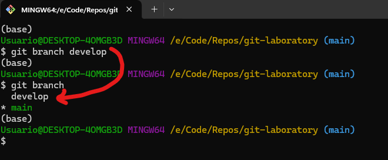

# Activity name

Now that we have the local repository ready on our computer, we can start working. Surely now you are wondering, if several people participate in the same repository, then how can each person carry out their own work without affecting the progress of the others?

Unlike tools like Google Docs or Google Slides, where everyone works on the same file, in a repository, each person creates their own space within it (called a branch) where they create and upload their corresponding part. Once someone or everyone has finished, their progress is combined to integrate the work into a main branch. Next, we will learn everything necessary to create branches and join the content of multiple branches.

**What is a branch?** A [branch](https://docs.github.com/en/get-started/quickstart/github-glossary#branch) is a parallel version of your repository. By default, your repository has one branch named main and it is considered to be the definitive branch. Creating additional branches allows you to copy the main branch of your repository and safely make any changes without disrupting the main project. Many people use branches to work on specific features without affecting any other parts of the project.

Branches allow you to separate your work from the main branch. In other words, everyone's work is safe while you contribute. For more information, see ["About branches"](https://docs.github.com/en/pull-requests/collaborating-with-pull-requests/proposing-changes-to-your-work-with-pull-requests/about-branches).

## Overview

In this activity, you will:

1. [Create branches](#creating-branches)
2. [Create commits in a new branch](#create-a-commit-in-a-new-branch)
3. [Merge branches](#merge-branches)
4. Deleting branches

## Steps

### Creating branches

Creating branches is an essential task for version control of any software project. The general recommendation is to create a branch for each activity or feature to be carried out, but you can also create a branch for each team member to make their respective progress. Once the activity is completed in each individual branch, they are merged to another to integrate the work.

Unlike branch creation, a branch is only deleted when it is no longer useful, either because its contents have been merged to another branch, or because it is out of date. Although the ideal is to keep all branches to have backup copies in case of an error, it can be beneficial to remove unnecessary ones to better manage the repository.

There are different ways to create branches: through the terminal, through a client, or through github. Create a new branch called **develop** using your preferred method. It is worth mentioning that once you create a branch with any of the following methods, it is not necessary to follow the steps with another method.

#### Create a branch using github.com

1. Open a new browser tab and navigate to your newly made repository. 

2. Navigate to the **< > Code** tab in the header menu of your repository.


3. Click on the main branch drop-down.


4. In the field, name your branch **develop**.

5. Click Create branch: **develop** to create your branch.


#### Create a branch using git bash or the terminal

1. Open git bash, or your terminal.
2. Use the command line interface to move to the directory of your repository.
3. You can create branches with either the **git branch** or **git checkout** commands.

    3.1 Using the [git-checkout](https://git-scm.com/docs/git-checkout) command to create a new branch. Be sure to change the name of the branch to develop. The **git checkout** command is used to switch between existing branches. When you use the **-b** parameter, the command creates the branch if it does not exist, and then switches to it.

    ```bash
    $ git checkout -b develop
    ```

    

    You can return to the main branch, or switch branches at any moment, using the **git checkout command**:

    ```bash
    $ git checkout {branch to move to}
    ```

    

    3.2 Using the **git branch** command allows us to list, create, or delete branches. To list the available branches, just use the `git branch` command.

    

    The asterisk shows the branch you are currently in. Right now, we only have the main branch. To create a new branch called develop, we use the following command:

    ```bash
    $ git branch develop
    ```

    It is worth noting that you won't change branches with this command, it only creates a branch.

    

    After you create the branch, you have to change branches using the **git checkout** command. A new command, **git switch** can also be used to switch branches.

    ```bash
    $ git checkout develop
    ```

    or

    ```bash
    $ git switch develop
    ```
### Create a commit in a new branch

Make sure you are in the directory of your repository, and in the **develop** branch before moving on with the activity.

1. Create a new text file called: *power_program.py*
2. Copy the following code to the file:

```python
import math

a = int(input('Enter 1st number: '))
b = int(input('Enter 2nd number: '))

result = math.pow(a, b)
print(f'{a} to the power of {b} is {result}')
```

3. Save the file.
4. Add the file to the staging area, and then create a commit:

```bash
$ git add power_program.py
$ git commit -m "Added power example in python."
```


**NOTE:** It is a good practice to issue the **git status** command regularly, so that you can check that the commands had the expected result, and that your commits contain the wanted changes.

5. To push the changes to the remote repository, we need to pass an argument to the **git push** command:

```bash
$ git push -u origin develop
```

The **-u** parameter adds a tracking reference for the branch in the remote repository.


6. Since we made changes to the **develop** branch, those changes should not be present on the main branch. To confirm this, let us go to the main branch, and see the files that are present there:


### Merge branches

In order to include the work done in one branch into another (usually a development branch into main), we need to use the **git merge** command. In the most frequent use cases, **git merge** is used to combine two branches. 

In these scenarios, git merge takes two commit pointers, usually the branch tips, and will find a common base commit between them. Once Git finds a common base commit it will create a new "merge commit" that combines the changes of each queued merge commit sequence.

Say we have a new branch feature that is based off the main branch. We now want to merge this feature branch into main.


Invoking this command will merge the specified branch feature into the current branch, we'll assume main. Git will determine the merge algorithm automatically.


Merge commits are unique against other commits in the fact that they have two parent commits. When creating a merge commit Git will attempt to auto magically merge the separate histories for you. If Git encounters a piece of data that is changed in both histories it will be unable to automatically combine them. This scenario is a version control conflict and Git will need user intervention to continue. 

In this case, we will merge the contents of the develop branch into the main branch:

1. Switch to the main branch:

```bash
$ git switch main
```

2. Make sure you have the latest changes on the main branch:

```bash
$ git pull origin main
```

3. Merge the contents of the **develop** branch into the main branch:

```bash
$ git merge develop
```

4. This will create a new commit on the main branch. Push the commit to the remote repository:

```bash
$ git push
```

The whole process can be seen here:


In github, we can see that the file should be in the main branch:


### Deleting branches

Once you’ve finished working on a branch and have merged it into the main code base, you’re free to delete the branch without losing any history:

```bash
$ git branch -d {branch name}
```

However, if the branch hasn’t been merged, the above command will output an error message:

```
error: The branch '{branch name}' is not fully merged. If you are sure you want to delete it, 
run 'git branch -D {branch name}'.
```

This protects you from losing access to that entire line of development. If you really want to delete the branch (e.g., it’s a failed experiment), you can use the capital -D flag:

```bash
git branch -D {branch name}
```

Since we merged the work on develop into main, we can safely delete it:

1. First check the branches we have with the **git branch** command.

```bash
$ git branch -a
```

The **-a** parameter, shows both the local branches, and the remote branches. This may be usefull once you work with other people and need work from their branches. Sometimes, you may not have a local copy of a remote branch.


2. The remote branches should match the one in github:


3. Make sure you are in the main branch. Then, use the **git branch** command to delete the **develop** branch:

```bash
$ git branch -d develop
```


Note that the command deletes the local branch, not the remote branch. There are two ways we can use to delete the remote branch: using terminal, and using github.

#### Deleting a remote branch in github

1. In github, select the option to view all branches:


2. Look for the branch you want to delete, and press the trash can icon.


3. That should delete the remote branch in github:


4. However, you still have the tracking information for the develop branch locally. Even after fetching and pulling data from the repository, the tracking information remains:


5. To remote deleted branches, you have to use the **git fetch** command, with the **--prune** option. The parameter removes, before fetching, any remote-tracking references that no longer exist on the remote. 


#### Deleting a remote branch from terminal

1. In your terminal, make sure you are in the main branch.
2. Once the develop branch is deleted locally, you can use the **-d** parameter of the **git push** command, to tell github to delete a remote branch.

```bash
$ git push origin -d develop
```

3. Confirm that the remote branch is delete with the **git branch -a** command.


## Finish

After you finish this activity, you should know:

- What a branch is, and how to create one.
- How to make a commit to a new branch.
- How to merge the changes in a new branch to another one. Usually, a development branch to the main branch.
- How to delete unnecessary branches.

## Resources

- [Git documentation](https://git-scm.com/docs/)
- [Atlassian git merge tutorial](Linkhttps://www.atlassian.com/git/tutorials/using-branches/git-merge)
- [Deleting remote branches](https://www.freecodecamp.org/news/git-delete-remote-branch/)
