# Collaborative work and Pull Requests 

In the previous exercises we have seen how to create, merge, and delete branches in a repository. However, you have done everything yourself in your own repository. What happens when you have to work with other people? Next, we'll work on a new repository to test what you've learned in these labs with a team.

## Overview

In this activity, you will:

1. [Learn how add contributors to a repository](#adding-collaborators)
2. [Practice creating branches, and commits to those branches](#creating-branches-and-commits)
3. [Merging remote branches made by others to the main branch](#merging-changes-from-the-remote-branches)
4. [Use github flow to create branches and pull requests](#using-github-flow-to-manage-the-remote-repository)

## Steps

Team up with two other people in the classroom. Each one will have a role throughout this activity:

- The person to whom the repository belongs to will be called 'Leader'.
- The people who will make progress in the repository will be called 'Participant'

### Adding collaborators

1. Decide which person will be the leader, since you will use their repository.

2. **Leader**
    a. In your repository, press the Settings button. In the left sidebar, press the Collaborators button. You will be asked for your 2FA code.

    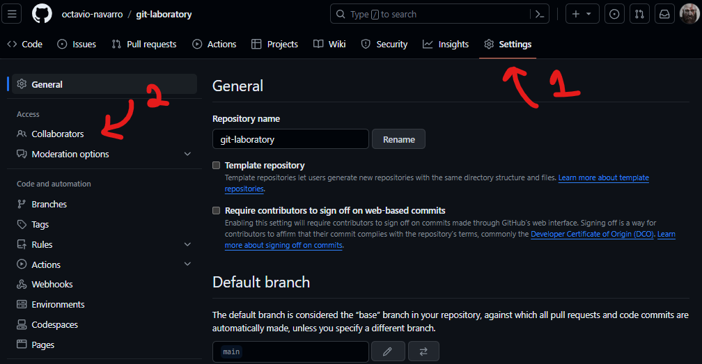

    b. Right now, your repository should not have any collaborators. On the lower right side, you can invite collaborators by pressing the **Add people** button.

    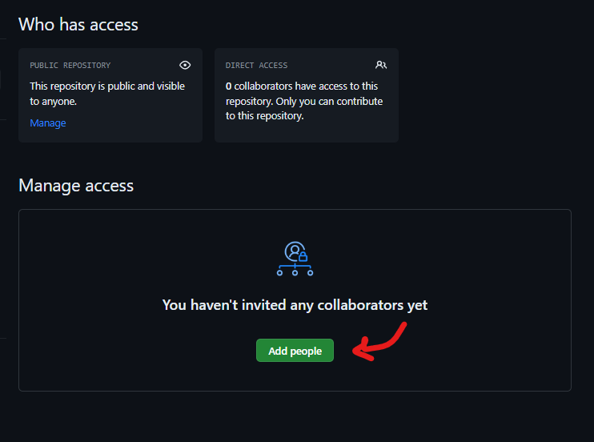

    c. Write either the username, or the email, of your team mates on the input field. When the correct user is shown on the dropdown list, select it and press the **Add {user} to this repository**.

    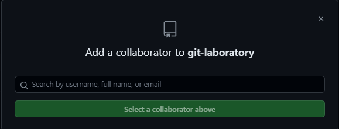
    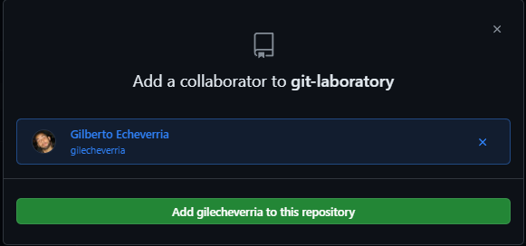

    d. Repeat the previous steps to add all of your teammates.

    e. Make sure you have your repository cloned in your machine.

3. **Participants**

    a. You will receive an email with the invitation to the repository. Press the 'View Invitation' button.
    b. The Leader's repository will be shown with the invitation. Press the 'Accept Invitation' button.
    c. The main menu of the Leader's repository will be displayed. Now you can start working on it.
    d. Create a folder on your computer called Laboratory-Branches.
    e. From the terminal, go to the address of the folder you just created.
    f. In Github, on the right side of the repository, press the green **Clone or download** button. Make sure you use the SSH link to download the repository.
    g. Type the command **git clone**. Then, paste the URL you copied from the repository.
    h. The remote repository will be cloned to the selected address, creating your local repository.

### Creating branches and commits

4. **Everyone**

    a. Create a branch with your respective user name.

    ```bash
    $ git checkout -b {username}
    ```

5. **Leader**

    a. Create a new file called **operations.py**.
    b. Copy the following text to the file:

    ```python
    a = int(input(“Give me the first number:”))
    b = int(input(“Give me the second number:”))

    # Display the addition

    # Display the subtraction

    # Display multiplication
    ```

    c. Save the file.
    d. Commit your changes to the local repository.
    e. Upload your changes and your branch to the remote repository with the following command:
    
    ```bash
    $ git push -u origin {leader's username}
    ```

6. **Participants**

    a. Open git bash or your terminal.
    b. Go to the folder where you cloned the leader's repository.
    c. To get all the branches and/or tags from one or more other repositories, along with the objects necessary to complete their histories, use the **git fetch -a** command. 

    ```bash
    $ git fetch -a
    ```

    d. Verify that you have the leader's branch with the **git branch** command.
    e. Make sure you are working in your branch: not the main branch, or the leader's branch.
    f. In order to get the changes on the leader's branch merged into your branch, use the **git pull** command with additional parameters. You can use the **git pull** command to automatically fetch and then merge that remote branch into your current branch.

    ```bash
    $ git pull origin {leader's username}
    ```

    g. After the pull, you should have the latest commit that is present on the leader's branch; including the python script. 
    h. Open the **operation.py** file.
    i. Remeber to check that you are working on your branch.
    j. One of the participants should finish the code to display de addition and the substraction. Another participant should delete the comment ```#Display the multiplication```. 
    k. Save the changes to the file, and make a commit.
    l. Push your changes to the remote repository.

### Merging changes from the remote branches

1. **Leader**

    a. You are going to be in charge of merging the changes on the participant's branches into your branch. 
    b. Make sure you are on your branch.
    c. Pull the changes from each of the participant's branches into your branch. 
    
    You can either:

        - Switch to each branch
        - Pull the changes
        - Switch to your branch
        - Merge the branches

    or:

        - Pull the changes directo into your branch
    
    d. Once you have the changes on your branch, ideally to test the participant's work, you can merge it into the main branch.
    e. Before merging with main, make sure you push the changes of your branch to the remote repository.
    f. Switch to the main branch, and use the **git merge** command to merge the changes from your branch into main.
    g. Upload the changes with the **git push** command.

2. **Participants**

    a. To download the changes made to main, switch to the main branch.
    b. Get the changes made to the remote repository using **git fetch** and **git pull**:

    ```bash
    $ git fetch -a
    $ git pull
    ```
    c. Verify that the changes to the file are locally in your computer.

3. **Everyone**

    a. Once the changes are in the main branch both locally in each participant's computer, and remotely on github, you can safely delete the branches.
    b. Delete the branch you created, and the corresponding remote branch in github.

    
### Using Github Flow to manage the remote repository

[GitHub Flow](https://docs.github.com/en/get-started/using-github/github-flow) is a collaborative development methodology for software projects hosted on GitHub. The philosophy behind GitHub Flow promotes rapid iteration, continuous collaboration, and early feedback, allowing you to create software that is more robust and adaptable to the changing requirements of modern projects.

It consists of the following basic steps:

1. Create a new branch from main or the stable base branch of the repository, usually with the descriptive name of the feature or bug to be addressed.
2. Make changes to the new branch and make frequent commits with clear and concise messages describing each modification made.
3. Open a Pull Request (PR) when the task is deemed complete and ready to be reviewed by other team members. The PR acts as a request to integrate the changes made in the new branch into the base branch.
4. Request reviews and comments on the code included in the PR. Reviewers can suggest improvements, ask questions, or request corrections before approving it.
5. Once all issues detected during the review have been resolved and the PR has received sufficient validations and approvals, merge it via a merge pull request into the base branch. If there are conflicts between branches, they must be resolved manually during this process.
6. Automatically deploy changes resulting from the merge to the production environment. This ensures that any problems discovered after the merge are fixed immediately and do not affect future versions.
7. Delete the used branch after successfully completing the previous steps. In this way, the branch history of the repository is kept clean and orderly.

**What is a pull request?**: Collaboration happens on a pull request. The pull request shows the changes in your branch to other people and allows people to accept, reject, or suggest additional changes to your branch. In a side by side comparison, this pull request is going to keep the changes you just made on your branch and propose applying them to the main project branch. For more information about pull requests, see ["About pull requests"](https://docs.github.com/en/pull-requests/collaborating-with-pull-requests/proposing-changes-to-your-work-with-pull-requests/about-pull-requests).

There are several advantages of using pull requests over directly merging branches in GitHub:

1. Encourages Collaboration: Pull requests allow team members to discuss the suggested changes, offer feedback, and add new commits before merging the code. This encourages collaboration and helps ensure that the changes being made align with the project goals.
2. Easier Code Review: With pull requests, reviewers can examine the proposed changes line-by-line and provide feedback before the code is merged. This makes it easier to catch potential issues early in the development cycle and maintain high code quality.
3. Centralized Communication: Pull requests serve as a centralized location for discussing and tracking changes. Instead of relying on email threads or other forms of communication, all relevant information is contained within the pull request itself.
4. Improved Workflow: Using pull requests can enhance the development workflow by providing clear separation between different stages of the development process. Developers create a separate branch for their changes, submit a pull request once they're ready for review, and then complete the merge after approval.
5. Better Access to Resources: When creating a pull request, developers have access to various tools and resources

Based on the previous work you did, we will create new changes using github flow.

1. **Participants**

    a. Each participant will work on a specific task:
        - The first one will create a hello world script in python. The script should print "Hello world". 
        - The second one will create a goodbye world script in python. The script should print "Goodbye world".
    b. Select one task, and create a new branch with a name that is related to the work you will be doing. For example: *feature-hello-script*.
    c. Switch to the new branch, and complete the task:
        - Create a new script with the appropriate functionality.
        - Make a commit, and push the branch to the remote repository.
    d. Once you have pushed to the remote repository, you can create a pull request.
    e. In github, you will see that a new option is available at the top of the repository: you can compare and create a pull request for the branch you just pushed.

    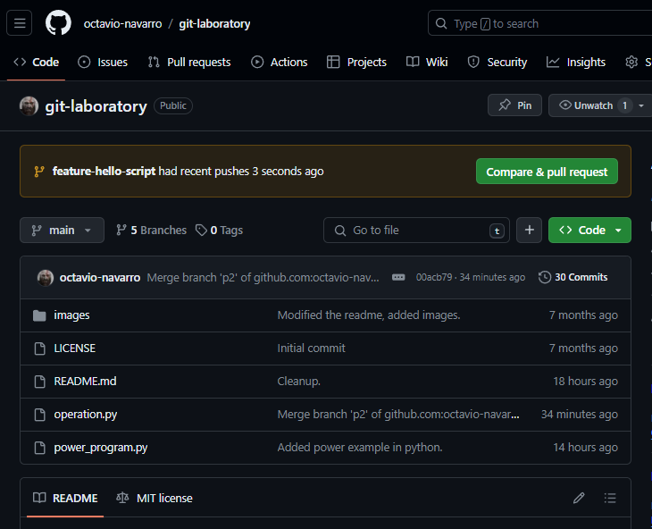

    After pressing the **Compara & pull request** button, you will see the following screen:

    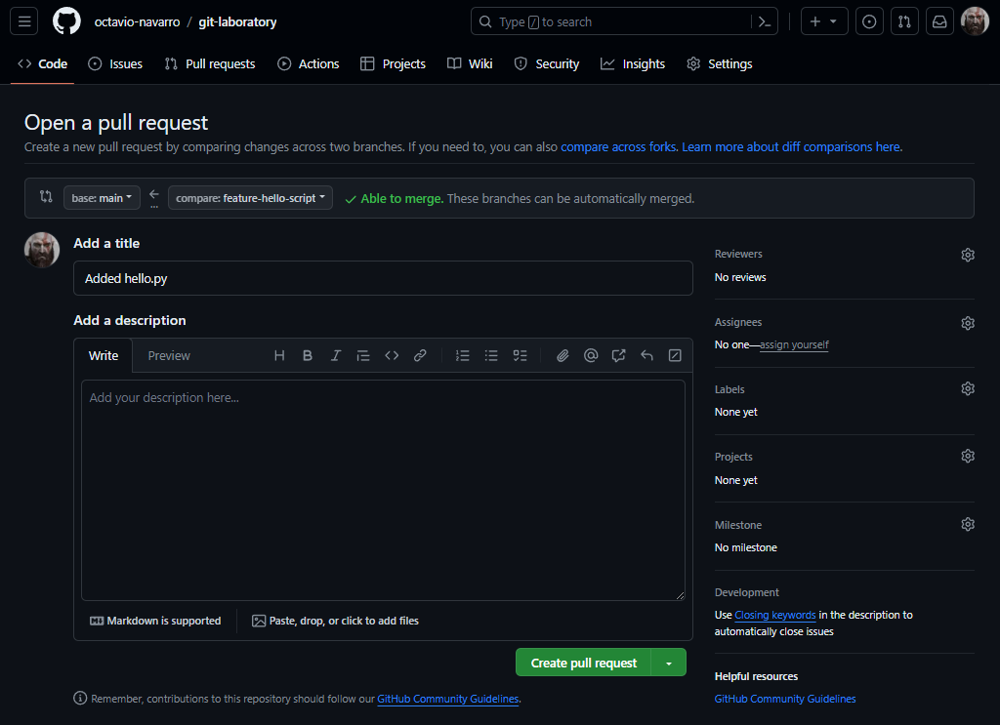

    Another option is to go to the **Pull requests** tab in github, and open a new pull request from there.

    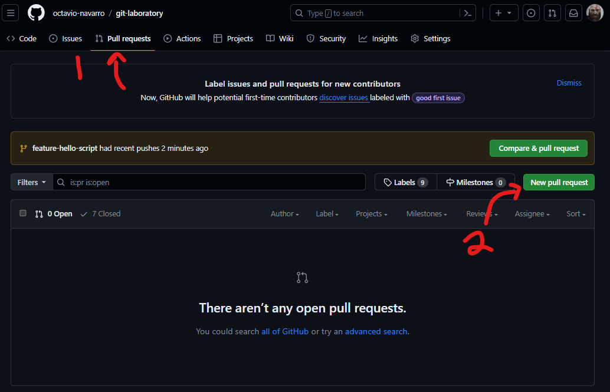

    After pressing the **New pull request** button, select the branch you want to issue the pull request from. In this example, it will be the **feature-hello-script** branch.

    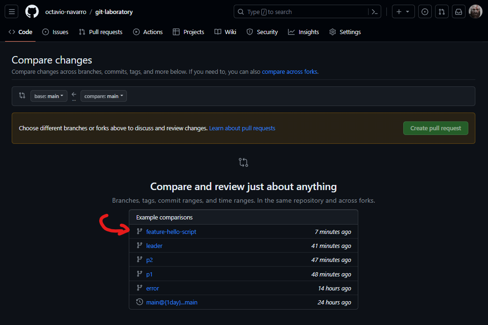

    Finally, press the ** Create pull request** button.

    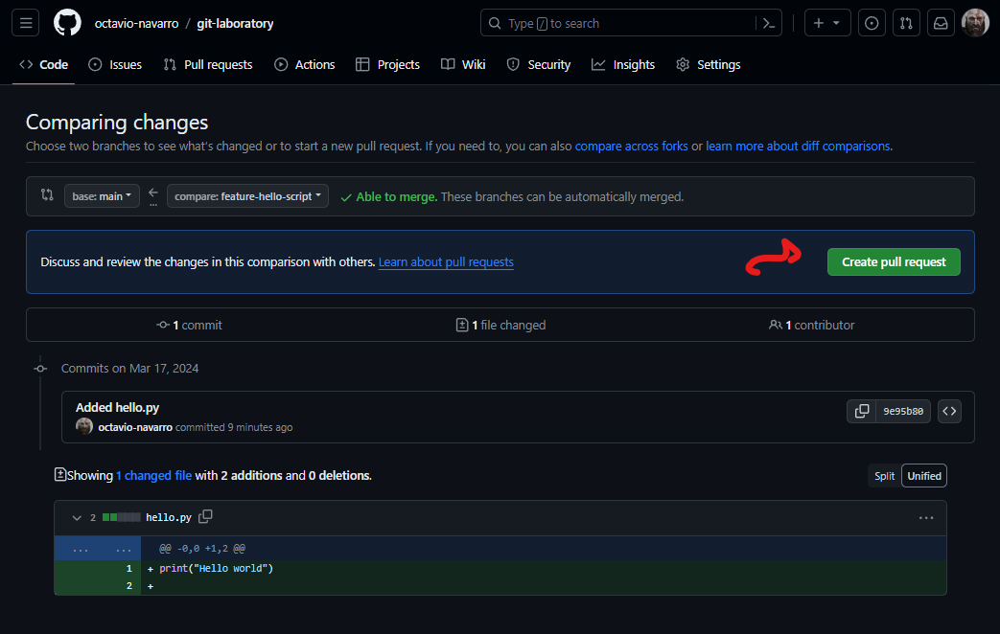

    f. Start creating a new pull request by using either the previous methods. 
    g. Fill the information on the description text box, and then press the **Create pull request** button on the lower right corner.

    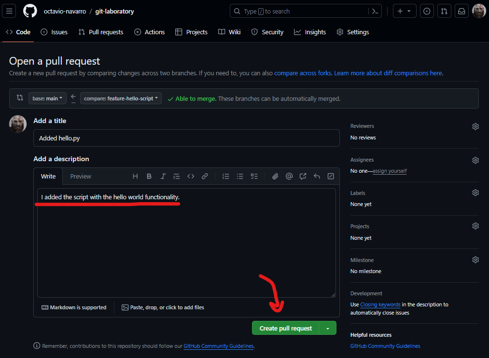

    h. Once you have created the pull request, the owner of the repository (in this case, the leader), will be informed that someone wants to make a pull request. It is usually the responsability of the owner of the repository to review the pull requests, and decide whether to merge into main or not.

2. **Leader**

    a. When you recieve the notification that someone wants you to review a pull request, and merge their changes into main, you can do so from the **Pull requests** tab in the repository.

    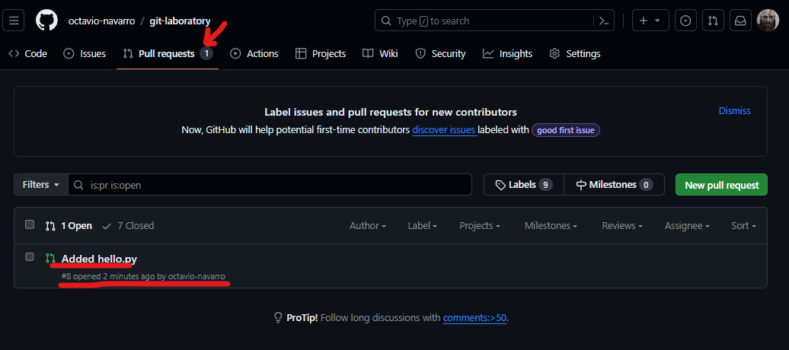

    b. Select the pull request that is opened.
    c. You can review the pull request by checking the **Commits** or the **Files changed** tabs. Additionally, you can leave a comment for the PR (for example, if the user missed something in the code). Finally, if the file can be merged automatically, you can just press the **Merge pull request** button.

    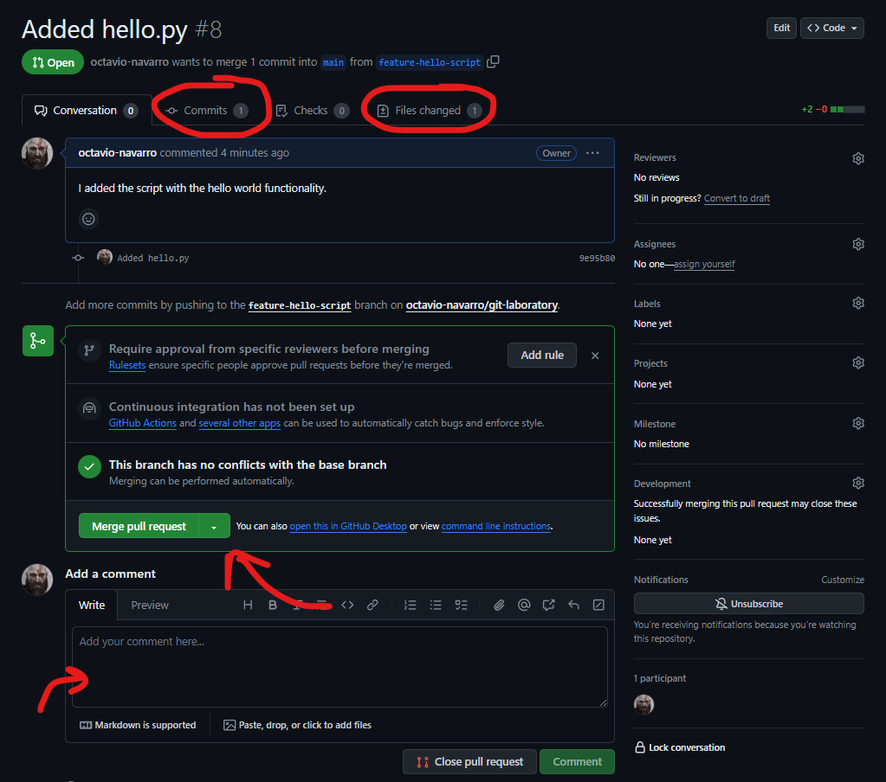

    d. From the **Commits* tab, you can check all the commits that are present in a PR, and review the changes in all of the files.

    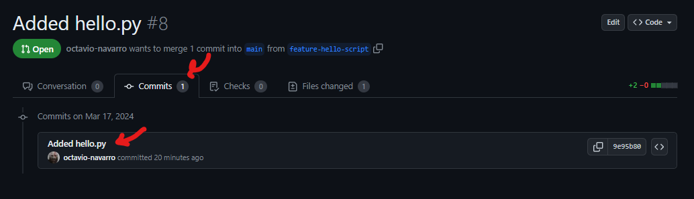
    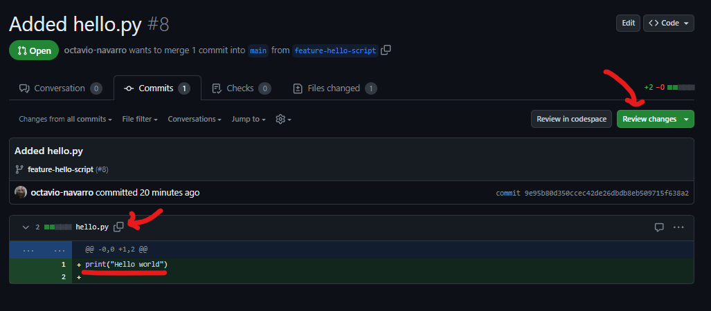

    e. With the **Review changes** button, you can be more specific about the outcome of your comments. You can either make a comment, approve, or request changes before approving the PR.

    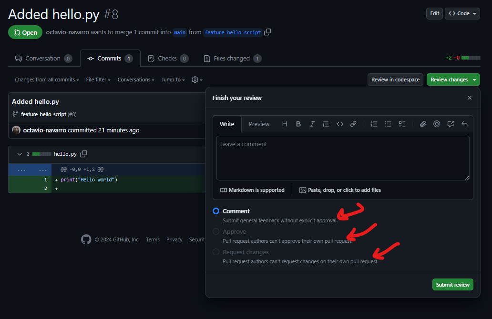

    f. Once you review the PRs, merge them into the main branch by pressing the **Merge pull request** button. If github detects no conflicts, you can usually just merge the branch.

    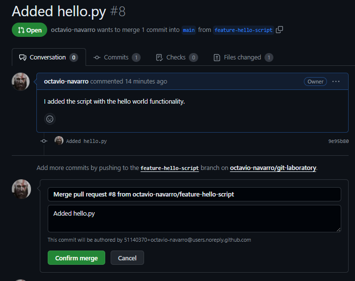

    g. After you press the **Confirm merge** button, you can delete the branch that was just merged.

    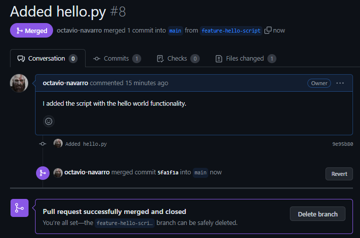

    h. Once you merge the PR into main, you can see the changes on the **Code** tab of the repository. 

    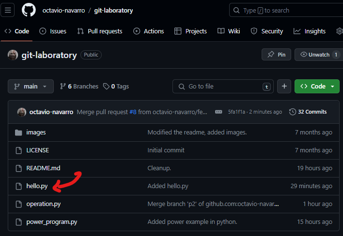

## Finish

After you finish this activity, you should know:

- How to add, and manage colaborators in a repository.
- How to create branches and commits on a remote repository. 
- How to merge changes from one branch into another, either by merging directly, or through pull requests.

## Resources

- [Working with remotes](https://git-scm.com/book/en/v2/Git-Basics-Working-with-Remotes#Fetching-and-Pulling-from-Your-Remotes)
- [Github Flow](https://docs.github.com/en/get-started/using-github/github-flow)
